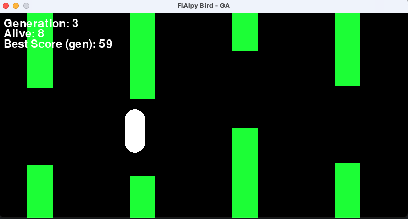

# Assignment 2

> Julian Jauk



# Flappy Bird with Genetic Algorithm
I wanted to do implement something by myself because Tetris seemed to boring for me. Hence i had a optional subject in school which was about AI. There we built an NeuralNetwork from scratch and implemented multiple for games and self driving cars. In addition we also worked with face Recognition and Deep Learning. So for Designing my Own App it was clear to me to do something with AI. So i wanted to do somehting quite easy and i thougt of different Ideas like drifting game or Flappy Bird AI. I quickly began implementing the Flappy Bird and the game it self was quickly setup since i had some experience with pygame. Also Flappy Bird has a pretty intuitive gameplay. So either you jump or not. Hence i had only 1 action i stuck with it. 

I read about different approach and i had 3 approaches in mind firstly i wanted to build a Deep Reinforcment Learning Algorythm for solving this, but quickly i realised that i have messed up my epsilon and something was not just right i stuck with the course of huggingface [1]. I learned really a lot by going through this course but applying it to my problem was really hard and drove me insane. Firstly i thought my parameters were messed up because something was a bit weird. All the birds kept flying up to the Roof and die. So after long debugging i thought my epsilion was the problem. Since the greedy-epsilion is normally startingwith $1$ and minmizes after generation to a value where the Bird doesn't have the ability to experiment more with the Action. But somehow my epsilon was the complete opposite. So when my epsilon was $0.12$ the birds where all doing a random stuff. And when the epsilon was $1$ the birds all did the same stuff -> fly to the roof and die. So it did not really learn. Then i looked at my Self-implemented Neural Network and asked ChatGPT and this was the Error. So i screwed the idea of implementing a Neural Network by only using **numpy**. So as chatGPT recommend me i started to use pytorch, since tensor was too complex and i didn't had much experience with it. So i am using this and again the outcome and performance of this Method was not what i have expected. So i thought: "Ok, just try a different algorithm for a while and if this doesn't work i go back to my QNetwork with the Deep-Reinforcment learnig approach.

## Deep Reinforcement Learning from scratch

State s:
$s = [\text{bird position,bird velocity,distance to pipe,pipe height}]$

Action Space:
$[0, 1] \rightarrow \text{jump or not}$

### First Steps

- [ ] get an observer -> know the game state
  - [ ] Bird State should keep track of the position distance to the pipe and height 

Another approach was Neural Evolution with multiple episodes, where each bird plays several rounds to calculate a more stable and averaged fitness score. The idea behind this is to reduce randomness in the evaluation, as a single episode might not accurately reflect how well a particular set of weights performs. By letting the bird attempt multiple episodes, you can smooth out the noise in the results and get a better sense of which solutions are truly effective. However, this comes at a cost—evaluating multiple episodes for every bird in the population drastically increases the computation time, making the process slower overall. But i didn't want to implement this since the third and final Approach called Genetic Algorythm was better fitting to me. 


## Genentic Algorithm

So yeah, i tried using a **Genetic Algorithm (GA)** for training the flappy bird AI, because honestly, the Q-learning stuff wasn't really working like i wanted. Instead of updating Q-values or relying on epsilon-greedy, i thought "why not just evolve the networks instead?" The idea is pretty simple: let the birds play, see how good they are (their fitness), and then take the best ones, mutate them, and repeat.

---

#### How I Did It

1. **Population**: I started with a population of random neural networks (like, completely random weights). Each bird gets its own network and plays using it.

2. **Fitness**: After each bird tries to survive, its score is used as the fitness. Basically, if a bird passed more pipes, it had a higher fitness. If it crashed early, well, tough luck.

3. **Selection**: I kept the top-performing birds (elitism). So like, the best 10% of the birds were cloned and carried over to the next generation unchanged. This made sure I didn’t lose good networks.

4. **Crossover**: For the rest of the population, I picked two "parents" (randomly from the best-performing birds) and combined their weights to create a new "child" network. I did this by splitting the weights of the parents—like half from one, half from the other. Sometimes it’s more mixed.

5. **Mutation**: After creating the new birds, I randomly changed (mutated) some weights in the networks. This step is super important because it allows the algorithm to explore new possibilities. The mutation was small, like tweaking weights by adding random noise, but not too much so the bird doesn’t forget everything.

6. **Repeat**: Then I ran the whole thing again for the next generation: let the birds play, calculate fitness, and repeat the GA steps.

---

#### What Worked and What Didn't

- **What worked**: Honestly, the evolution process started to make the birds better. After some generations, I could see them figuring out how to stay alive longer (like not flying straight into pipes). The elitism helped a lot because it kept the progress from being reset.

- **What didn’t work**: It was soooo slow! Because every bird has to play a full episode, and then you repeat that for the whole population, and then for multiple generations. Plus, sometimes the mutation would mess things up, and suddenly all the birds were flying into the roof again... or the floor. That was frustrating.

---

#### Improvements?

Maybe next time I could combine the GA with something else, like neural evolution with gradient descent (I think its called NEAT?). But for now, this was a fun way to make flappy bird AI without worrying too much about math-y reinforcement learning formulas!


#### Config:
This Config file is provided to adjust level details and trianing details for the flappy bird AI.

```yml
population_size: 200              # how many will spawn in one generation
mutation_probability: 0.05        # much the bird will mutate from the best
mutation_standard_deviation: 0.3  
elitism: True                     # uses best individuals

stop_condition:
  generations: .inf  # end condition for exmaple it should stop after 200 gens
  score: .inf        # after 200 Points it should stop for example .inf means infinity
  time: .inf         # after a certain amount of seconds it shoold stop

enable_acceleration: True # Enables acceleration meaning the game speeds up so 
save_best: True           # saves the best and as best_model.pth
load_previous_best: True  # uses the best_model.pth and loads the weights back
hardstuck_gen: 5

level:
  pipe_gap: 180         # The space between top and bottom pipes dont go below 150 it is too difficult and the game could generate impossible leveles
  pipe_min_height: 60   # The minimum height of the top pipe -> good wood be above 50
  pipe_max_height: 300  # The maximum height of the top pipe
  pipe_speed: 4         # The speed at which pipes move to the left
```


#### Sources:
https://www.youtube.com/watch?v=wDVteayWWvU

https://karpathy.github.io/2016/05/31/rl/

[1] : https://huggingface.co/learn/deep-rl-course/unit1/what-is-rl

https://pytorch.org/docs/stable/index.html

https://www.geeksforgeeks.org/reading-and-writing-yaml-file-in-python/

https://www.geeksforgeeks.org/genetic-algorithms/

https://medium.com/@eugenesh4work/how-to-solve-games-with-genetic-algorithms-building-an-advanced-neuroevolution-solution-71c1817e0bf2

https://www.youtube.com/@CodeBullet

https://chatgpt.com/ -> marked

